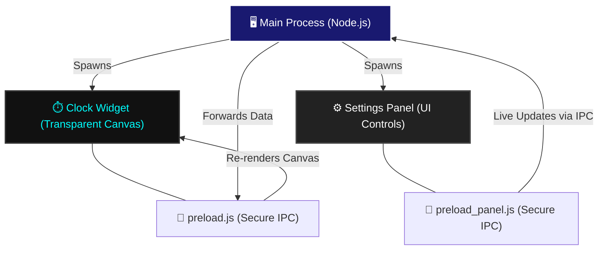

<div align="center">
  
# 🌌 Floating Desktop Clock Widget 🌌

**A pure, frameless, and ultra-customizable desktop clock built with Electron & HTML5 Canvas.**

[](https://opensource.org/licenses/MIT)
[](#)
[](#)

*Float seamlessly on your desktop while tracking time in style.*

</div>

---

## ⚡ Quick Look Features

| Feature | Description |
| :--- | :--- |
| 🎨 **Massive Customization** | 52 unique clock faces (Ghost, Classic, Motion) |
| 🕰️ **Interchangeable Hands** | 10 styles (Lancet, Sword, Skeleton, Needle, etc.) |
| 🌘 **Curated Themes** | 10 dark aesthetics (Obsidian, Void, Abyss, Midnight) |
| 🪟 **Frameless & Transparent** | Blends flawlessly into any wallpaper |
| 🚀 **High Performance** | Precomputed math, subpixel precision & zero-lag UI |

---

## 🛠️ Detailed Installation Guide

Get up and running in minutes. Follow these step-by-step instructions.

### 1️⃣ Prerequisites
Before you begin, ensure you have the following installed on your system:
*   [**Git**](https://git-scm.com/downloads) (to clone the repository)
*   [**Node.js & npm**](https://nodejs.org/) (Version 16.x or higher is recommended)

### 2️⃣ Clone the Repository
Open your terminal (or Command Prompt / PowerShell) and run:
```bash
git clone https://github.com/c0pperfi3ld/Clock.git
cd Clock
```

### 3️⃣ Install Dependencies
Let npm pull down all the necessary Electron packages:
```bash
npm install
```

### 4️⃣ Launch the App
Fire up the clock widget locally:
```bash
npm start
```

*(Optional) Packaging for Production:*
If you want to create a standalone `.exe` or `.app` file, you can install an packager:
```bash
npm install -g electron-packager
electron-packager . ClockApp --platform=win32 --arch=x64
```

---

## 🎯 How to Use

Once launched, you will see two windows:

1.  **The Floating Clock:** The main frameless widget on your desktop.
    *   **Drag to Move:** You can drag the clock around your screen by clicking and holding on the clock face.
2.  **The Settings Panel:** A dedicated control center for live customization.
    *   **Design Selection:** Instantly switch between Ghost, Classic, and Motion designs.
    *   **Theme & Hands:** Mix and match colors and hand styles with real-time feedback.
    *   *Tip:* Keep the panel open on a secondary monitor to tweak designs without blocking your view!

---

## 🏗️ Architecture Infographic

The application utilizes a secure dual-window Electron architecture to keep the widget lightweight and isolated from the settings panel.



## 📜 License
Distributed under the MIT License. See `LICENSE` for more information.

---
<div align="center">
  <i>Designed for performance. Built for aesthetics.</i>
</div>
