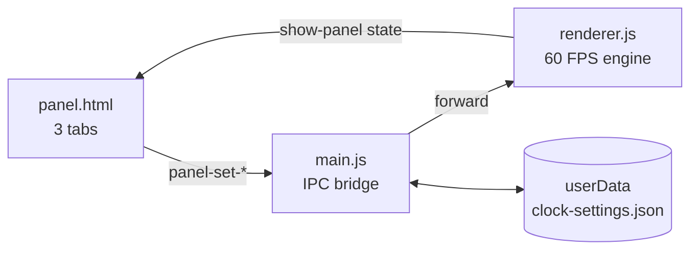
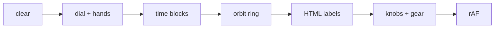

<div align="center">

# ⏱ ChronoCore

**A borderless, canvas-rendered desktop clock widget — tasks, time blocks & Pomodoros included.**

52 dials · 16 hands · 10 themes · 26 tooltip motions · 13 todo loops · 17 orbit rings · 18 block FX


</div>

---

## ✨ Why ChronoCore

| Priority | Feature |
|---|---|
| 🔴 **Circular task labels** | Task text rides the orbit ring itself — arches over the top half, smiles under the bottom half, always readable, never clipped |
| 🔴 **Live task cards** | Every todo loops its selected animation forever, phase-offset so cards feel alive |
| 🟡 **52 × 16 × 10 design genome** | Dials, hands & themes combine into millions of unique faces |
| 🟡 **Rotating outer dial / orbit ring** | 17 ring styles, 0–5× clockwise speed (Alt+scroll), pauseable |
| 🟢 **Zero-DOM clock face** | 60 FPS Canvas 2D · DPR-aware · borderless always-on-top window |
| 🟢 **Golden Angle color engine** | 137.5° hue spacing — every new block lands on the most distinct hue |
| 🟢 **Pomodoro + time blocks** | Elapsed/remaining dual-color wedges · click-to-spawn · drag-to-resize · 18 animated FX |

---

## 🚀 Install

```powershell
git clone https://github.com/c0pperfi3ld/Clock.git
cd Clock
npm install
npm start
```

> `npm run dev` opens DevTools for debugging.

---

## 🎨 Design Catalog

### 52 Dial Styles

| Group | Count | Styles |
|---|---|---|
| **Hands-only** | 13 | minimal · ghost · mist · prism · wireframe · shadow · ember · glass · starlight · pulsar · cyberpunk · zenith · glow |
| **With dial** | 25 | classic · minimal · roman · neon · skeleton · chrono · bauhaus · swiss · pilot · diver · artdeco · sundial · dashboard · dotmatrix · floatingnum · astronomy · submariner · industrial · papercraft · retrodigital · zen · hologram · copper · monochrome · regatta |
| **Unique motion** | 14 | orbit · concentric · radar · gradientarc · hourglass · sonar · sine · dna · pendulum · compass · eclipse_motion · matrix_rain · equalizer · vortex |

### 16 Hand Types

*tapered · sword · dauphine · leaf · baton · skeletonH · arrow · spade · cathedral · needle · spike · alpha · chronometer · luminous · minimalist_dot · art_deco*

### 10 Themes

*midnight · obsidian · charcoal · slate · eclipse · void · graphite · onyx · shadow · abyss*

---

## 🎭 Animation Catalog

### 26 Label Motions — curved text on the ring, not boxes

| # | Motion | # | Motion | # | Motion |
|---|---|---|---|---|---|
| 1 | 🎾 Bounce | 10 | ⚡ Jitter | 19 | 🌀 Zoom Spin |
| 2 | 🌫️ Fade | 11 | 💫 Orbit | 20 | 📺 Glitch |
| 3 | 📤 Slide Up | 12 | 🫁 Breathing | 21 | 💡 Flicker |
| 4 | 🔄 Flip | 13 | 🪀 Elastic | 22 | 🌊 Drift |
| 5 | ⌨️ Typewriter | 14 | 😵‍💫 Wobble | 23 | ⏳ Pendulum |
| 6 | ✨ Glow In | 15 | 🚨 Neon Pulse | 24 | 🐍 Snake |
| 7 | 💥 Scale Pop | 16 | 🥶 Shiver | 25 | 👁️ Blink |
| 8 | 🎪 Swing | 17 | 💓 Heartbeat | 26 | 🎉 Ta-Da |
| 9 | 🌊 Wave | 18 | 🛸 Float Tilt | | |

> Labels are canvas glyphs set on a circle at `orbit + gap + half-height + motion pad` — strictly outside the dotted ring. Upper-half arcs stand upright, lower-half arcs flip so text reads correctly. Click text to rename, the trailing × chip to clear, the leading dot shows the block color. Per-label font shrink (min 8px) plus **window auto-fit** handle the true window edges; the dial never changes size.

### 13 Todo Loops — cards animate forever, not just on entrance

*⏸️ Static · 🌊 Float · 💓 Pulse Glow · 🎪 Sway · 🫁 Breathe · ✨ Shimmer · 🏀 Bob · 🪱 Wiggle · ↔️ Drift X · 💗 Heartbeat · 🚨 Neon Glow · 🫧 Jelly · 🌅 Glow Drift*

### 17 Outer Dial / Orbit Ring Styles — clockwise, 0–5× speed

*⚪ Dotted Spin · ⭕ Double Orbit · ✨ Glow Pulse · ☄️ Comet · 🌈 Rainbow · ✨ Sparkle · 🌊 Tide · 🌐 Cyber Scan · 🌌 Stardust Swarm · 💫 Ripple Waves · ⚡ Quantum Arc · 🌀 Vortex Spiral · ⚙️ Chrono Cog · 🏎️ Neon Tracer · 🌑 Solar Corona · 🧬 Orbit Helix · 🛡️ Hex Shield*

### 18 Block Animations — with speed control

*⏸ None · 💓 Pulse · ✨ Glow · 🫁 Breathe · ⚡ Shimmer · 🌈 RB Glow · 🌈 RB Pulse · 🪩 Disco · 📡 Radar Sweep · 🦓 Marching Stripes · 🚨 Laser Border · ✨ Stardust Embers · 🌊 Wave Ripple · ⚡ Plasma Arc · 🌌 Aurora Flow · ⏳ Sandglass Fill · 👾 Cyber Glitch · 💗 Heartbeat*

> Each block can override the global effect from its own card in the Blocks tab.

---

## 🖼 How It Works

### IPC Pipeline



### Per-Frame Render



### Golden Angle Colors

```
h_n = (n × 137.508°) mod 360°

   h₀ =    0°  ●
   h₁ =  137°  ●
   h₂ =  275°  ●
   h₃ =   52°  ●     ← wraps to most-distant slot
```

---

## 🎮 Usage

| Action | How |
|---|---|
| Move clock | Drag empty dial |
| Add block | Click outer ring · pick colors in ⚙ panel |
| Edit block | Click wedge · drag red/blue handles |
| Rename task | Click its floating label |
| Delete task | Click × on the label |
| Todo list | `+` button or type + Enter · checkbox · flag cycles priority · dot sets color |
| Text size | Config → Text Size slider, `A−/A+`, or Ctrl+scroll (0.3–5×) |
| Orbit speed | Config slider or Alt+scroll (0 = paused) |
| Settings | Click ⚙ top-right · Faces / Motion / Blocks / General tabs (searchable, collapsible) |

---

## 🧠 Architecture

```
Clock/
├── main.js              ← window mgmt + IPC bridge + settings store
├── preload.js           ← clock-window IPC surface
├── preload_panel.js     ← settings-panel IPC surface
├── index.html           ← clock window (canvas + todo panel)
├── panel.html           ← settings panel (Faces / Motion / Blocks / General)
├── index.css            ← layout + all keyframe animations
├── renderer.js          ← Canvas engine + DOM labels + todos
└── package.json         ← 1 dependency: electron@^35
```

**IPC channels** — `drag-start` · `drag-move` · `drag-end` · `show-panel` · `panel-set-{style,theme,hands,opacity,sessions,block-opacity,block-anim,tooltip-anim,tooltip-size,orbit-speed,orbit-style,todo-anim,window-fit}` · `fit-window` · `focus-time` · `blur-time` · `clock-update-time` · `panel-set-ontop` · `panel-close` · `close-app` · `save-settings` · `load-settings`

---

## 🔧 Customization

```js
// New dial
STYLES.myCustom = (ctx, cx, cy, r) => {
  ctx.strokeStyle = '#ff00ff';
  ctx.lineWidth = 2;
  ctx.beginPath(); ctx.arc(cx, cy, r, 0, Math.PI * 2); ctx.stroke();
};

// New theme
THEMES.sunset = { accent: '#ff6b6b', sec: '#ffd93d', glow: 'rgba(255,107,107,0.5)' };

// New block animation
case 'my-effect': return { opMul: ..., rOff: ..., blur: ..., colorOverride: '...' };

// New ring-text motion: add a case to labelMotionParams() in renderer.js
// { r/rf: radial wobble, t/tf: tangential wobble, a/af: alpha dip,
//   g: glow 0-2, w/wf: per-glyph wave, hb: heartbeat, gl: glitch gate }
```

---

## 🗺 Roadmap

- 🔴 System tray + global hotkey
- 🟡 Multi-monitor per-display settings
- 🟡 Alarm sounds
- 🟢 Theme marketplace (JSON palette packs)
- 🟢 Plugin API for third-party dials

---

## 📊 Stats

```
Dials:       52       Tooltip motions:  26
Hands:       16       Todo loops:       13
Themes:      10       Orbit styles:     17
Deps:        1        Block FX:          18
Cold start:  <1.2s    Frame rate:   60 FPS
```

---

<div align="center">

**[⭐ Star](https://github.com/c0pperfi3ld/Clock)** · **[🐛 Bug](https://github.com/c0pperfi3ld/Clock/issues)** · **[💡 Feature](https://github.com/c0pperfi3ld/Clock/issues/new)**

*MIT License · © 2026 c0pperfi3ld*

</div>
