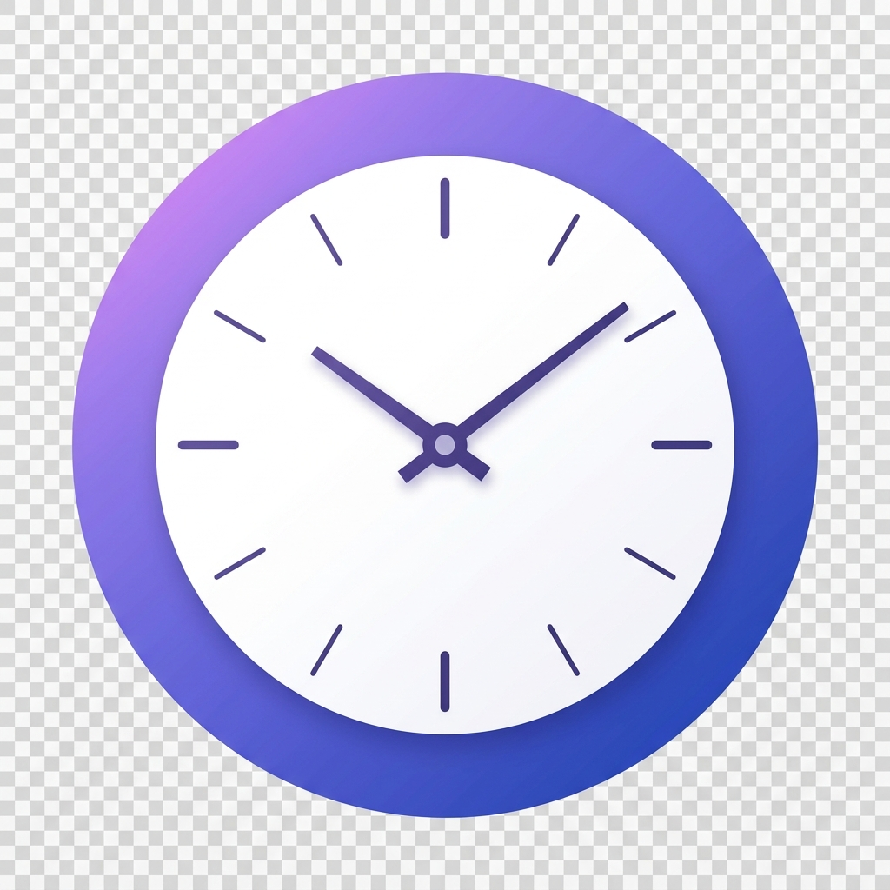

<div align="center">

# ⏱ ChronoCore

**A borderless, canvas-rendered desktop clock widget with time blocks, priority todos, and a daily board — built on Electron.**

[](https://www.electronjs.org/)
[](LICENSE)
[](#)
[](#-whats-new-in-v2)

<br>



<br>

*56 clock faces · 25 hand styles · 16 color themes · 58 orbit rings · 45 tooltip animations · 44 block effects · 20 border animations*

</div>

---

## ✨ Features

<table>
<tr>
<td width="50%">

### 🕐 Floating Analog Clock
- Borderless, always-on-top, transparent window
- DPR-aware Canvas 2D rendering at 60 FPS
- Zero DOM overhead — pure canvas engine
- Independent clock scale slider (decouple dial size from window)

</td>
<td width="50%">

### 🎨 Deep Customization
- **56** clock face designs (13 ghost, 25 dial, 14 motion, 4 special)
- **25** hand styles (tapered, sword, dauphine, cathedral, flame…)
- **16** color themes (midnight, glacier, ember, orchid, solar…)
- **58** orbit ring animations
- **45** tooltip animations
- **44** time-block effects

</td>
</tr>
<tr>
<td width="50%">

### ✅ Priority Todos
- Multi-list tabs with category switching
- Weight arrows (▲▼) for priority sorting
- Per-task color dots
- Subtask nesting with drag & drop
- URL detection with smart shortening (YouTube → play icon)
- Collapsible panel with opacity & fade controls

</td>
<td width="50%">

### 📋 Board View
- Vertical day timeline (8 AM – 7 PM)
- Click an hour to create a block
- Drag edges to resize
- Link time blocks to todos
- Adjustable top/bottom gaps

</td>
</tr>
<tr>
<td width="50%">

### 📅 Calendar & State
- Mini calendar for date navigation
- Per-date todo lists
- Full state restoration on restart (date, tab, scroll, collapse)
- Midnight auto-rollover

</td>
<td width="50%">

### ⚡ Performance
- Render-loop throttling (skip frames when idle)
- Immediate settings flush on critical changes
- Debounced save (300ms) for routine updates
- Shadow cleanup & bounds clamping
- Single runtime dependency (`electron`)

</td>
</tr>
</table>

---

## 🆕 What's New in v2

> **+3,302 lines added, +384 lines refined** across 20 files

### New Features
| Feature | Description |
|---|---|
| **Drag & Drop Todos** | Grab any task — drop in middle third to nest as subtask, top/bottom to reorder. Whole subtrees move together. |
| **URL Links** | Paste URLs into tasks — auto-detected, smart-shortened (~35 chars). YouTube links get a ▶ icon. Click opens default browser via `shell.openExternal`. |
| **Todo Panel Collapse** | Toggle button to collapse/expand the entire todo panel. State persists across restarts. |
| **Background Opacity** | `--bgA` CSS variable driven by a 0–100% slider. Control app-wide transparency. |
| **Todo Fade Mask** | Configurable fade height (0–120px) at the bottom of the todo list for a polished scroll edge. |
| **Shine Animation** | Customizable shine sweep across the border: angle, width, opacity, color, easing, delay, direction, fade, and repeat. |
| **Clock Scale** | Independent multiplier for the drawn dial radius — shrink the clock without shrinking the window. |
| **App Padding** | Adjustable inset between the rounded border and clock/todo content. |
| **Percentage Label** | Configurable remaining-time label: visibility, font size, color, position (`below` / `right` / `inline`), with optional time readout. |
| **Calendar Animation** | Entrance animation for the mini calendar (`pop`, etc.). |

### Expanded Catalogs

| Category | v1 | v2 | Added |
|---|:---:|:---:|:---:|
| Orbit ring styles | 38 | **58** | +20 |
| Tooltip animations | 25 | **45** | +20 |
| Block animations | 24 | **44** | +20 |
| Border animations | — | **20** | new |

### New Orbit Rings (v2)
`aurora-band` · `beacon` · `binary-orbit` · `celtic-knot` · `chrono-compass` · `cosmic-web` · `crystal-lattice` · `cyber-scan` · `eclipse-corona` · `hex-shield` · `hyper-warp` · `laser-sweep` · `magnetic-field` · `molecular-bond` · `neutron-star` · `particle-collider` · `photon-torpedo` · `quantum-tunnel` · `runic-circle` · `solar-prominence`

### Test Infrastructure
| File | Purpose |
|---|---|
| `e2e-todo.cjs` | Full E2E integration test (19 assertions, real Electron app, isolated profile) |
| `test-move-engine.cjs` | Unit tests for drag & drop logic (11 cases) |
| `test-harness.html` | Headless Puppeteer layout verification harness |

---

## 🚀 Getting Started

```bash
git clone https://github.com/c0pperfi3ld/Clock.git
cd Clock
npm install
npm start
```

Open DevTools with `npm run dev`.

---

## 🎮 Controls

| Action | How |
|---|---|
| **Move window** | Drag the empty dial or the bottom grip |
| **Resize window** | Any edge or corner handle |
| **Exit** | Hover the `×` (top-left of the dial) |
| **Add a time block** | Click the outer ring → pick colors in ⚙ |
| **Edit a block** | Click a wedge → drag red/blue handles |
| **Add a todo** | `+` button or type + `Enter` |
| **Reorder todos** | ▲▼ weight arrows, or drag & drop |
| **Nest as subtask** | Drag onto the middle of another task |
| **Color a todo** | Click the color dot |
| **Open settings** | ⚙ (top-right) — searchable, collapsible tabs |
| **Board view** | Rectangle icon in the tab bar |
| **Calendar** | 📅 button — navigate dates, per-day tasks |
| **Text size** | `Ctrl` + scroll |
| **Orbit speed** | `Alt` + scroll |
| **Collapse todos** | Toggle button next to the todo panel |

---

## 🧩 Architecture

```
renderer.js        ← 60 FPS canvas engine: dial, blocks, orbit ring, labels, handles,
                     todo panel, drag engine, link parser, animation router
main.js            ← Electron main process: window management, IPC bridge,
                     JSON settings store, screen bounds, shell.openExternal
panel.html         ← ⚙ settings panel: Faces / Hands / Themes / Motion / Blocks / General
index.html         ← clock window: canvas + todo panel + resize handles
preload.js         ← contextBridge API for renderer ↔ main IPC
preload_panel.js   ← contextBridge API for settings panel ↔ main IPC
index.css          ← all styles: clock, todos, drag indicators, border anims, shine
```

Settings persist to `userData/clock-settings.json`. All changes are backward-compatible with v1 saved data.

---

## 🎭 Complete Design Catalog

<details>
<summary><strong>Clock Faces (56)</strong></summary>

<br>

**Ghost / Hands Only (13)**
`ghost` · `mist` · `prism` · `wireframe` · `shadow` · `ember` · `glass` · `starlight` · `pulsar` · `cyberpunk` · `zenith` · `dark` · `glow`

**With Dial (29)**
`classic` · `minimal` · `roman` · `neon` · `skeleton` · `chrono` · `bauhaus` · `swiss` · `pilot` · `diver` · `artdeco` · `sundial` · `dashboard` · `dotmatrix` · `floatingnum` · `astronomy` · `submariner` · `industrial` · `papercraft` · `retrodigital` · `zen` · `hologram` · `copper` · `monochrome` · `regatta` · `aurora` · `noir` · `lumen` · `gridline`

**Unique Motion (14)**
`orbit` · `concentric` · `radar` · `gradientarc` · `hourglass` · `sonar` · `sine` · `dna` · `pendulum` · `compass` · `eclipse` · `matrix_rain` · `equalizer` · `vortex`

</details>

<details>
<summary><strong>Hand Styles (25)</strong></summary>

<br>

`tapered` · `sword` · `dauphine` · `leaf` · `baton` · `skeleton` · `arrow` · `spade` · `cathedral` · `needle` · `spike` · `alpha` · `chronometer` · `luminous` · `minimalist_dot` · `art_deco` · `scalpel` · `flame` · `crystal` · `ruler` · `halo` · `meridian` · `ribbon` · `bracket` · `barley`

</details>

<details>
<summary><strong>Color Themes (16)</strong></summary>

<br>

`midnight` · `obsidian` · `charcoal` · `slate` · `eclipse` · `void` · `graphite` · `onyx` · `shadow` · `abyss` · `glacier` · `orchid` · `ember` · `forest` · `solar` · `ocean`

</details>

<details>
<summary><strong>Orbit Ring Styles (58)</strong></summary>

<br>

`astrolabe` · `aurora-band` · `aurora-ring` · `beacon` · `binary-orbit` · `bounce-dots` · `celtic-knot` · `chains` · `chrono-compass` · `comet` · `constellation` · `cosmic-web` · `crystal-lattice` · `cyber-scan` · `dna-helix` · `double` · `double-helix` · `eclipse-corona` · `ferris` · `fireflies` · `gear-teeth` · `glow` · `hex-shield` · `hyperspace` · `hyper-warp` · `laser-sweep` · `lightning` · `magnetic-field` · `matrix-rain` · `molecular-bond` · `neon-chase` · `neon-pulse` · `neutron-star` · `number` · `ouroboros` · `particle-collider` · `particles` · `photon-torpedo` · `plasma-ring` · `prism-spectrum` · `pulse-ring` · `pulse-wave` · `quantum` · `quantum-tunnel` · `rainbow` · `rainbow-flow` · `runic-circle` · `saturn` · `shockwave` · `solar-prominence` · `sound-frequency` · `sparkle` · `stargate` · `star-trail` · `super-nova` · `tide` · `vortex` · `wave-ring`

</details>

<details>
<summary><strong>Border Animations (20)</strong></summary>

<br>

`pulse` · `glow` · `breathe` · `shimmer` · `rainbow` · `scan` · `dash-flow` · `corner-pulse` · `neon-flicker` · `elastic` · `gradient-shift` · `ghost` · `trace` · `plasma` · `morse` · `wave` · `electric` · `aurora` · `geiger` · `dna` · `meteor` · `heartbeat`

</details>

---

## 🧪 Testing

```bash
# E2E integration tests (launches real Electron, isolated profile)
node e2e-todo.cjs

# Unit tests for drag & drop move engine
node test-move-engine.cjs
```

---

## 📄 License

MIT © 2026 Miraj Khan
